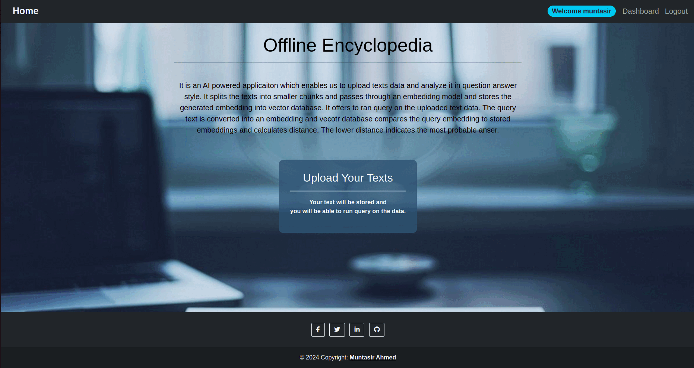

<div align="center">
    <a href="">
      
    </a>
</div>

<br/>

<!-- Table of contents -->
<div>
  <h1>Table of Contents</h1>
  <ul>
    <li><a href="#introduction">Introduction</a></li>
    <li><a href="#vector-database-overview">Vector Database Overview</a></li>
    <ul>
      <li><a href="#chromadb">Chromadb</a></li>
    </ul>
    <li><a href="#embedding-model">Embedding Model</a></li>
    <li><a href="#installation">Installations</a></li>
    <li><a href="#ready-the-chat-llm-tiny-llama">Ready the Chat LLM [Tiny Llama]</a></li>
    <li><a href="#run-the-application">Run the application</a></li>
    <li><a href="#note">Note</a></li>
  </ul>
</div>

# Introduction
Offline Encyclopedia is an AI powered Django application. The purpose of building this application is to explore the concept of `Vector Database` and `Embedding` and to use the power of `LLMs` to build scalable AI systems which will run offline and on CPU. This application can be used to analyze large amount of documents in Q/A style. The application has the feature which user can use to upload several `TEXT` and `PDF` files. Then these texts will be divided into smaller chunks and it will be stored in the vector database. Then, there is a query section where user can ran query on their uploaded documents. The model will retrieve similar chunks from the Vector Database which is the knowledge base for the Chat LLM. Then these knowledge has been passed to the LLM along with the query. Then the model generates the answer based on the query and retrieved context.

> This application has a special feature of integrating `Local Knowledge Base`. Which gives the chat model more context to generate more accurate answer. If user is not satisfied with the result generated from the uploaded documents, they can use the local knowledge base which has been created from the text and PDF documents of the directory `local_knowledge_base`.  It is a container for a significantly large amount of data as compare to the uploaded one.

<div align="center">
    
</div>

<br>

# Vector Database Overview

<h3>What is Vector Database?</h3>

> It is the collection of learnable embeddings which has a certain dimension. It enables us to compact unstructured data in a single dimension. The exact same kind of database operations can be performed in Vector Database. It uses several mathematical functions to find similarity between query and stored embeddings.

Learn more about distance functions [here](https://weaviate.io/blog/distance-metrics-in-vector-search).

<ul>
  <li>Cosine Similarity.</li>
  <li>DOT Product.</li>
  <li>Euclidean Distance.</li>
</ul>

> The query is converted into embedding vector by doing a forward pass from the embedding/feature extractor model. Then distance is calculated between query vector and stored vector using above distance calculator functions.

<h3>Which vector database is used?</h3>

> There are handful of vector database available for use. Some works in local and some are cloud based database. Each one has its won advantages and disadvantages.

<ul>
  <li><a href="https://qdrant.tech/">Qdrant</a></li>
  <li><a href="https://docs.pinecone.io/docs/overview">Pinecone</a></li>
  <li><a href="https://docs.trychroma.com/">Chroma DB</a></li>
</ul>

## Chromadb
Chromadb is one of the best in my view because of its vast functionalities and integrations. It provides a wrapper function over [HuggingFace](https://huggingface.co/models) models which is very useful. Using this functions, we can choose any model for our specific use case. Furthermore, It also provide access to [ONNX](https://onnx.ai/onnx/api/) type models.

# Embedding Model

Embedding model is a pre-trained model that is assigned with the task of generating embedding from data. In this application I have used a pre-trained weights of ONNX type transformer model [sentence-transformers/all-MiniLM-L6-v2](https://chroma-onnx-models.s3.amazonaws.com/all-MiniLM-L6-v2/onnx.tar.gz). This model generates embedding of size 384.

# Installation

Clone the project repository. Go to the project root directory and create a virtual environment with python 3.11.4 and activate it using following commands.

NOTE: Following commands only works for Linux Operating System.

```command
virtualenv venv
source venv/bin/activate
```

When your virtual environment is activated then go for installing dependencies. Run the following commands for installing required libraries and packages.

```command
pip install -r requirements.txt
```

# Ready the Chat LLM [Tiny Llama]

Create a folder named `llama` in the project root directory. Run the following python script to download the model form HuggingFace [neuralmagic/TinyLlama-1.1B-Chat-v0.4-pruned50-quant-ds](https://huggingface.co/neuralmagic/TinyLlama-1.1B-Chat-v0.4-pruned50-quant-ds). After running the script you will get your model downloaded in a folder named `TinyLlama`. Place that folder into the `llama` folder that you have create in the project root directory.

```python
from huggingface_hub import snapshot_download

snapshot_download(
    repo_id='neuralmagic/TinyLlama-1.1B-Chat-v0.4-pruned50-quant-ds', 
    local_dir='TinyLlama', 
    local_dir_use_symlinks=False
)
```

Following is the project root directory structure after completing all the steps mentioned.

```
|---dashboard
|---database
|---documents
|---llama
|---local_knowledge_base
|---static
    |---css
    |---images
|---templates
    |---includes
|---text_retrieval
|---uploads
|---venv
 ---.gitignore
 ---LICENSE
 ---manage.py
 ---README.md
 ---requirements.txt
```

# Run the application

First of all, you need to apply migration to create all the database tables that Django provides by default. Then you need to create a `super user` which will act as an admin to access the admin dashboard. Use the following Django command to create a super user account. It will ask `username`, `email`, `password`.

Commands to apply migrations
```command
python manage.py makemigrations
python manage.py migrate
```

Super user creation command
```command
python manage.py createsuperuser
```


After successfully installing all the dependencies run the following command for executing the Django application.

```command
python manage.py runserver
```

# Note

For using this application user must have to create an account. The file upload section only allows text and pdf files. When user logged in, the application creates a collection and deletes it when user logged out. It also creates another collection for local knowledge base and inserts all the documents in the directory named `local_knowledge_base`. This is created only for the first time and it remains. Once user logged out the vector collection for user uploaded documents will be lost but the collection for the local knowledge base remains.